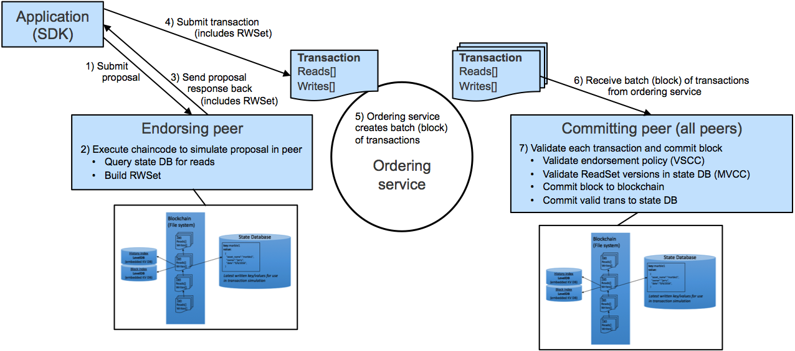

# The Workshop

## How did it all start?

October 2008 It all started with Satoshi Nakamoto and his paper [Bitcoin: A Peer-to-Peer Electronic Cash System](https://bitcoin.org/bitcoin.pdf) which addressed a key problem in electronic commerce:

## Linux Foundation's Hyperledger

## Use Cases: https://www.ibm.com/blockchain/use-cases/

## The Hyperledger components

### The Blockchain

## Docker images

~~~~
1. fabric-ca
2. fabric-zookeeper
3. fabric-kafka
4. fabric-couchdb
5. fabric-javaenv
6. fabric-tools
7. fabric-ccenv
8. fabric-orderer
9. fabric-peer
10. fabric-baseimage
11. fabric-baseos
~~~~

## Message flow in a Hyperledger Fabric

## Major components of the Hyperledger Fabric

[Hyperledger Fabric Glossary](https://fabrictestdocs.readthedocs.io/en/latest/glossary.html#hyperledger-fabric-glossary)

[Hyperledger FAQ](https://hyperledger-fabric.readthedocs.io/en/release-1.1/Fabric-FAQ.html)

<b>Hyperledger Fabric</b> is a private and permissioned blockchain without crypto-currency. Members enroll through a Membership Service Provider which calls the Hyperledger Fabric Certificate Authority which issues PKI-based 
certificates to network member organizations and their users. 

<b>Blockchain Network</b>
A blockchain network consists of, at minimum, <b>one peer</b> (responsible for endorsing and committing transactions) leveraging <b>an ordering service</b>, and a <b>membership services component (certificate authority)</b> that distributes and revokes cryptographic certificates representative of user identities and permissions.

<b>Consensus algorithm</b> is the process of reaching agreement on the next set of transactions to be added to the ledger. First a transaction must be endorsed, then passed to the Orderers for validation and commitment.  The simplest consensus algoritm is SOLO, which only needs one consenter to write transactions to the ledger.

<b>Distributed Ledger</b> The Ledger is constructed in Chaincode by the Ordering Service and is a peer-to-peer network 
of a totally ordered hashchain of blocks of (valid or invalid) transactions. The hashchain imposes the total order of blocks in a ledger and each block contains an array of totally ordered transactions. This imposes total order across all transactions.

The Distributed Ledger consists of an immutable Blockchain and the World State Database. The latter is a database containing the current value of the set of key-value pairs that have been added, modified or deleted by the set of validated and committed transactions in the blockchain.

The Ledger is kept at all peers and, optionally, at a subset of orderers. 

<b>Hyperledger Fabric channel</b> is a private “subnet” of communication between two or more specific network members, for the purpose of conducting private and confidential transactions. A channel is defined by members (organizations), anchor peers per member, the shared ledger, chaincode application(s) and the ordering service node(s).

<b>Chaincode </b> Chaincode is what Ethereum calls <b>Smart Contracts </b>. They are invoked by a client application external to the blockchain network – that manages access and modifications to a set of key-value pairs in the World State. Smart contract chaincode is installed onto peer nodes and instantiated to one or more channels.

[Chaincode and the Oracle Problem](https://medium.com/@antsankov/the-oracle-problem-isnt-a-problem-and-why-smart-contracts-makes-insurance-better-for-everyone-8c979f09851c)

<b>Peer</b> A network entity that hosts the ledger and runs chaincode containers in order to perform read/write operations to the ledger. Peers are owned and maintained by members. The number of peers required to endorse a transaction is driven by the endorsement policy that is specified at chaincode deployment time.

<b>Orderer</b> is responsible for establishing consensus. It is a defined collective of nodes that orders transactions into a block. The ordering service exists independent of the peer processes and orders transactions on a first-come-first-serve basis for all channel’s on the network. The ordering service is designed to support pluggable implementations beyond the out-of-the-box SOLO and Kafka varieties. The ordering service is a common binding for the overall network; it contains the cryptographic identity material tied to each Member.

## Exercise 0: [Blockchain Platform Playground:](https://blockchaindevelop.mybluemix.net/login)
## Exercise 1: [Start bulding Hyperledger Fabric applications](HL%20BYFA.md)
## Exercise 2: [Develop a Node.js smart contract and web app for Global Finance with Blockchain] (https://developer.ibm.com/patterns/global-financing-use-case-for-blockchain/)

## Demo: [The Blockchain Bean](https://www.ibm.com/thought-leadership/blockchainbean/)
## Exercise 3: [The Marbles App](https://github.com/IBM-Blockchain/marbles)
## Exercise 4: [IBM Blockchain Platform](https://www.ibm.com/blockchain/platform)

https://www.ibm.com/blockchain/platform?|1298|22081

https://github.com/IBM-Blockchain/vehicle-manufacture. Click on Blue Button to kick off the deployment.

https://vehicle-manufacture-basilar-fenestration.mybluemix.net/tutorial

# Where do we go from here?

1. Go through the IBM Code Patterns for Blockchain. https://developer.ibm.com/patterns/category/blockchain/
1. Create more advanced applications from the list of IBM Use Cases 
1. Engage with IBM Developer Advocates on your plans and ISV free resources
1. https://www.coindesk.com/ibm-wants-know-ways-blockchain-can-go-wrong/

# Appendix
